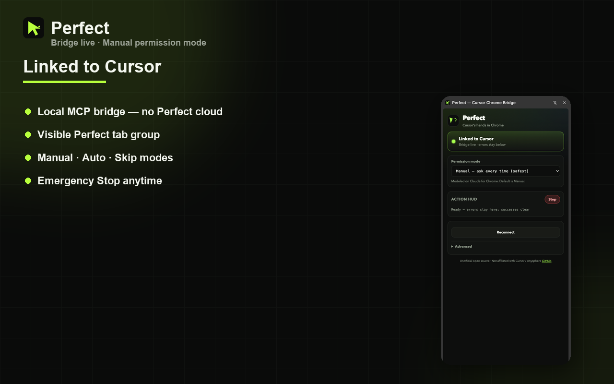
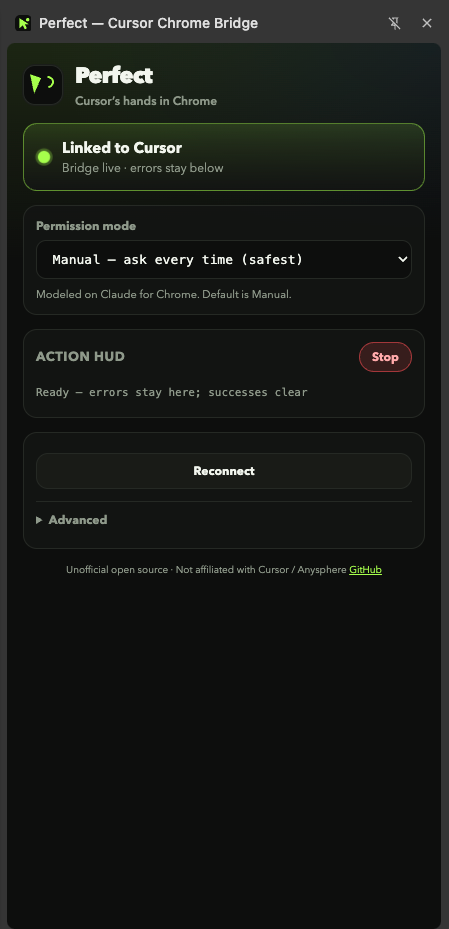
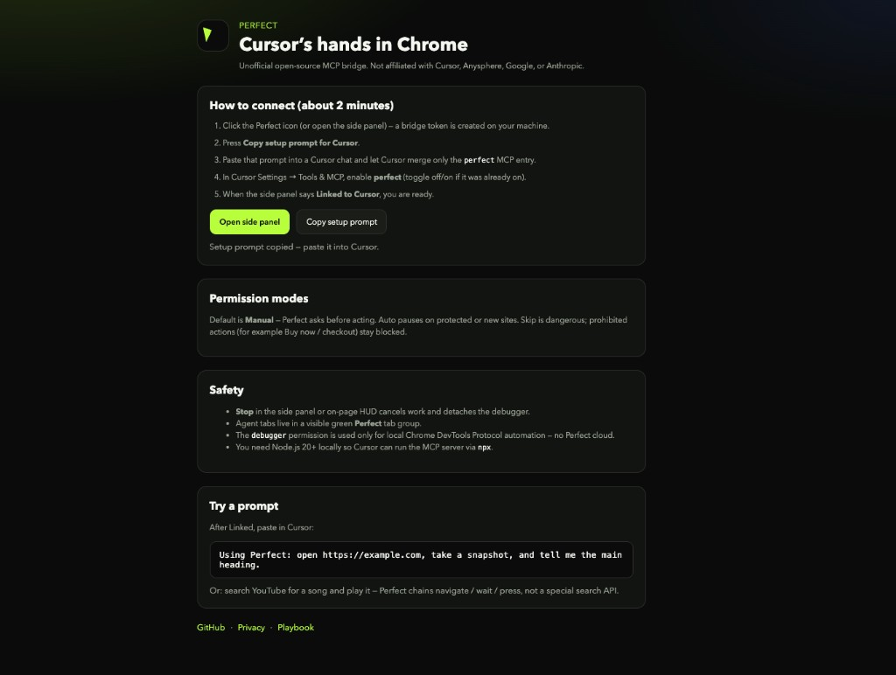
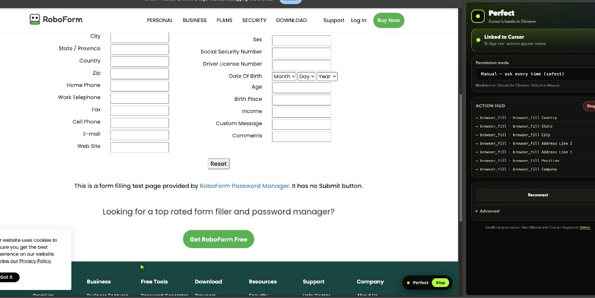

<p align="center">
  
</p>

<h1 align="center">Perfect</h1>

<p align="center"><strong>Give Cursor hands in your Chrome.</strong></p>

<p align="center">
  Unofficial open-source MCP bridge — Cursor agents navigate, click, fill, screenshot, and inspect <em>your</em> real Chrome, with Manual permissions by default.
</p>

<p align="center">
  <a href="https://gtarafdar.github.io/perfect/"></a>
  <a href="https://github.com/Gtarafdar/perfect/releases/latest"></a>
  <a href="LICENSE"></a>
  
</p>

<p align="center">
  <a href="https://gtarafdar.github.io/perfect/">Website</a> ·
  <a href="https://github.com/Gtarafdar/perfect/releases/latest">Download zip</a> ·
  <a href="https://gtarafdar.github.io/perfect/playbook.html">Playbook</a> ·
  <a href="https://gtarafdar.github.io/perfect/security.html">Security</a> ·
  <a href="https://gtarafdar.github.io/perfect/privacy.html">Privacy</a> ·
  <a href="https://gtarafdar.com/donate">Donate</a>
</p>

> **Not affiliated with Cursor, Anysphere, Google, or Anthropic.** Unofficial community project.

---

<p align="center">
  
</p>

## Why I built this

Cursor is excellent in the repo. The moment I needed it in my **real browser** — same cookies, same session, forms, research, YouTube — I hit a wall. Cloud browser demos weren’t enough. I wanted the agent on my desk, in tabs I can see, with permissions I control and a Stop button that actually stops.

**Perfect** is that bridge: local MCP + Chrome extension, visible Perfect tab group, Manual by default, no Perfect cloud.

**v0.2** — Linked bridge is stable · ~26 tools · Chrome Web Store listing submitted (waiting on review).

---

## Screenshots

| Linked | Welcome / setup | Agent at work |
|:---:|:---:|:---:|
|  |  |  |

---

## Quick start

1. **Install the extension** — [download zip](https://github.com/Gtarafdar/perfect/releases/latest), unzip, Chrome → `chrome://extensions` → Developer mode → **Load unpacked** (or wait for Chrome Web Store).
2. Open Perfect → **Copy setup prompt for Cursor**.
3. Paste into Cursor — it merges MCP config (`npx -y perfect-mcp`; GitHub fallback if npm isn’t published yet).
4. Enable **perfect** in Settings → MCP → panel shows **Linked**.

Requires **Node.js 20+** locally for the MCP server.

### Try this prompt

> Using Perfect: search YouTube for “Saiyaara song”, open the official YRF title track, and play it.

More recipes: [Agent playbook](https://gtarafdar.github.io/perfect/playbook.html)

---

## How it works

```
Cursor  --MCP stdio-->  perfect-mcp  --localhost WS + token-->  Chrome extension  --CDP-->  Perfect tab group
```

| Mode | Behavior |
|---|---|
| **Manual** (default) | Approve actions |
| **Auto** | Fewer prompts on trusted sites; protected still pauses |
| **Skip** | Dangerous; prohibited actions still hard-block |

### Tools (summary)

| Area | Examples |
|---|---|
| Tabs | `browser_navigate` `browser_tabs` `browser_tab_focus` `browser_tab_close` |
| Read | `browser_snapshot` `browser_extract` `browser_console` `browser_network` |
| Act | `browser_click` `browser_fill` `browser_type` `browser_press` `browser_upload` `browser_drag` |
| See | `browser_screenshot` (+ annotations) |
| Guard | `browser_stop` · Manual prompts · purchase/checkout hard-blocks |

Full matrix + security model: [Security](https://gtarafdar.github.io/perfect/security.html) · [EVAL for Cursor](docs/EVAL_FOR_CURSOR.md)

---

## Develop

```bash
npm install && npm run build
npm test                      # Vitest unit + integration
npm run test:e2e              # Playwright fixtures
npm run test:e2e:extension    # Unpacked extension + MCP WS bridge
npm run pack:extension        # → perfect-extension.zip (CWS / Load unpacked)
```

---

## Maker

<p>
  
</p>

**Gobinda Tarafdar** — WordPress product marketer · stubborn problem-solver · lifelong Harry Potter devotee.

By day: Product Marketing Specialist at [WPBakery](https://wpbakery.com/). Nights: workshop tools that scratch my own itches.

| | |
|---|---|
| Site | [gtarafdar.com](https://gtarafdar.com/) |
| X | [@Gtarafdarr](https://x.com/Gtarafdarr) |
| LinkedIn | [gobinda-tarafdar](https://www.linkedin.com/in/gobinda-tarafdar/) |
| GitHub | [Gtarafdar](https://github.com/Gtarafdar) |
| Donate | [gtarafdar.com/donate](https://gtarafdar.com/donate) |

If Perfect saves you time, a [star](https://github.com/Gtarafdar/perfect) or a [small donation](https://gtarafdar.com/donate) keeps the workshop lit.

---

## Other projects from the workshop

Free, local-first where it counts.

| Project | What it does |
|---|---|
| [Last Sign-in](https://gtarafdar.github.io/last-sign-in/) | Remembers how you signed in — never passwords or cookies |
| [Porter](https://gtarafdar.github.io/porter/) | Copy folders between your Macs like Finder · MCP for AI IDEs |
| [Aligner](https://github.com/Gtarafdar) | Free local Chrome toolkit for design, measure, and WordPress |
| [FinderFlow](https://github.com/Gtarafdar) | Mac file manager with built-in editor |
| [Slack Agent Bridge](https://github.com/Gtarafdar) | MCP bridge for Cursor and Claude |
| [Auto AFK Slack](https://github.com/Gtarafdar) | Lock your Mac, Slack goes AFK |
| [Slack Teammate Time](https://github.com/Gtarafdar) | Teammate local times inline in Slack |
| [Broken Link Checker](https://github.com/Gtarafdar) | Find broken links without leaving the page |
| [Docscriber](https://github.com/Gtarafdar) | Documentation, conjured |
| [TheRecaller](https://github.com/Gtarafdar) | A memory charm for what you forget online |
| [TheEditra](https://github.com/Gtarafdar) | AI video editor |
| [The Quill Press](https://github.com/Gtarafdar) | Tech news, Daily Prophet style |
| [Costlas](https://github.com/Gtarafdar) | Cost of living for 140+ countries |

---

## Links

- [Website](https://gtarafdar.github.io/perfect/)
- [Agent playbook](https://gtarafdar.github.io/perfect/playbook.html)
- [Security](https://gtarafdar.github.io/perfect/security.html) · [Privacy](https://gtarafdar.github.io/perfect/privacy.html)
- [Capability report](docs/capability-report.md) · [Share kit](docs/share/social-copy.md)
- [Chrome Web Store submit notes](docs/store/SUBMIT.md)

## License

[MIT](LICENSE) © 2026 Gobinda Tarafdar
